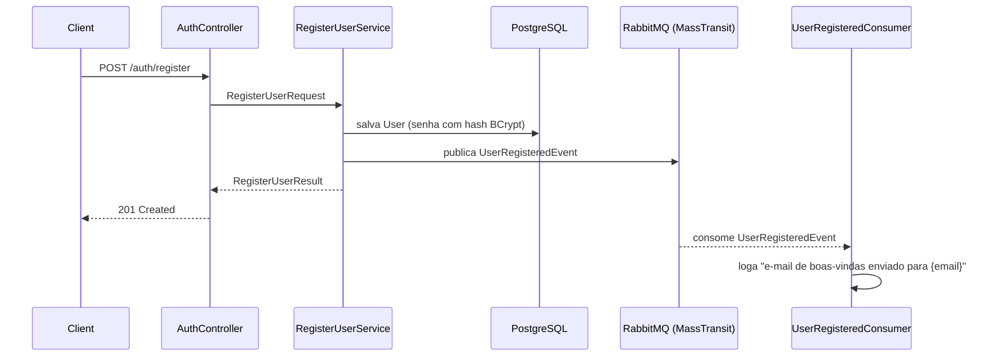

# 00 — Architecture Overview

## Objetivo do projeto

SecureGate é uma API de autenticação em .NET 8 que publica um evento assíncrono
(`UserRegistered`) via RabbitMQ/MassTransit quando um usuário se registra. Projeto de
portfólio com foco em praticar mensageria, mantendo o escopo enxuto e evitando
overengineering.

## Escopo da v1

- Registro de usuário (nome, e-mail, senha com hash BCrypt)
- Login com emissão de JWT (com expiração; sem refresh token nesta versão)
- Publicação do evento `UserRegistered` após persistir o usuário
- Consumer no mesmo processo que loga "e-mail de boas-vindas enviado para {email}"
- Todo usuário autenticado tem o mesmo nível de acesso (sem RBAC)

Fora de escopo da v1 (candidatos a v2): Outbox Pattern, Saga, múltiplos serviços,
refresh token com rotação, RBAC. Frontend Angular entra como etapa separada
([specs/04-frontend.md](04-frontend.md)) após o backend estar completo e validado.

## Decisões técnicas

| Decisão | Escolha | Justificativa |
|---|---|---|
| Banco de dados | PostgreSQL via Docker Compose | Sobe junto com API e RabbitMQ num único `docker compose up`; mais representativo de projetos .NET profissionais que SQLite. |
| CQRS/MediatR | Não usar | Application layer com services simples (`RegisterUserService`, `LoginService`). O foco de aprendizado é mensageria, não CQRS. |
| Refresh token | Não incluir na v1 | Mantém escopo enxuto; JWT simples com expiração é suficiente. Pode entrar como v2. |
| Camadas | 3 projetos (Domain, Application, Api) + 1 de testes | Infra (EF Core, BCrypt, JWT, MassTransit) fica dentro de `Api/Infrastructure/` em vez de um 4º projeto — cada interface tem uma única implementação, então um projeto `Infrastructure` separado seria cerimônia sem ganho real. |
| Consumer | No mesmo processo da API | Sem necessidade de um worker/serviço separado para este escopo. |

## Estrutura de pastas

```
SecureGate/
├── src/
│   ├── SecureGate.Domain/
│   │   └── Entities/
│   │       └── User.cs
│   │
│   ├── SecureGate.Application/
│   │   ├── Abstractions/              # IUserRepository, IPasswordHasher, ITokenGenerator
│   │   ├── Auth/
│   │   │   ├── RegisterUserService.cs
│   │   │   ├── LoginService.cs
│   │   │   └── Dtos/
│   │   └── Events/
│   │       └── UserRegisteredEvent.cs # contrato compartilhado entre publisher e consumer
│   │
│   └── SecureGate.Api/
│       ├── Controllers/
│       │   └── AuthController.cs
│       ├── Infrastructure/
│       │   ├── Persistence/           # AppDbContext, UserRepository, Migrations
│       │   ├── Security/              # BcryptPasswordHasher, JwtTokenGenerator
│       │   └── Messaging/             # UserRegisteredConsumer, config do MassTransit
│       ├── Program.cs
│       └── appsettings.json
│
├── tests/
│   └── SecureGate.Tests/              # xUnit
│
├── specs/                             # este diretório
├── docker-compose.yml                 # API + RabbitMQ + PostgreSQL
├── Dockerfile
└── README.md
```

## Fluxo de dados (alto nível)



## Processo de trabalho

- **Spec-Driven Development**: cada etapa tem uma spec em `specs/NN-nome.md` escrita e
  validada antes da implementação.
- **Conventional Commits**: `feat:`, `fix:`, `test:`, `docs:`, `refactor:`, `chore:`.

## Etapas planejadas

1. `01-user-registration.md` — entidade `User` + registro (sem mensageria)
2. `02-login.md` — login + JWT
3. `03-messaging.md` — RabbitMQ + MassTransit (evento + consumer)
4. `04-frontend.md` — frontend Angular básico (pós-backend)
